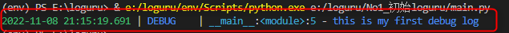
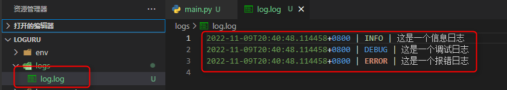
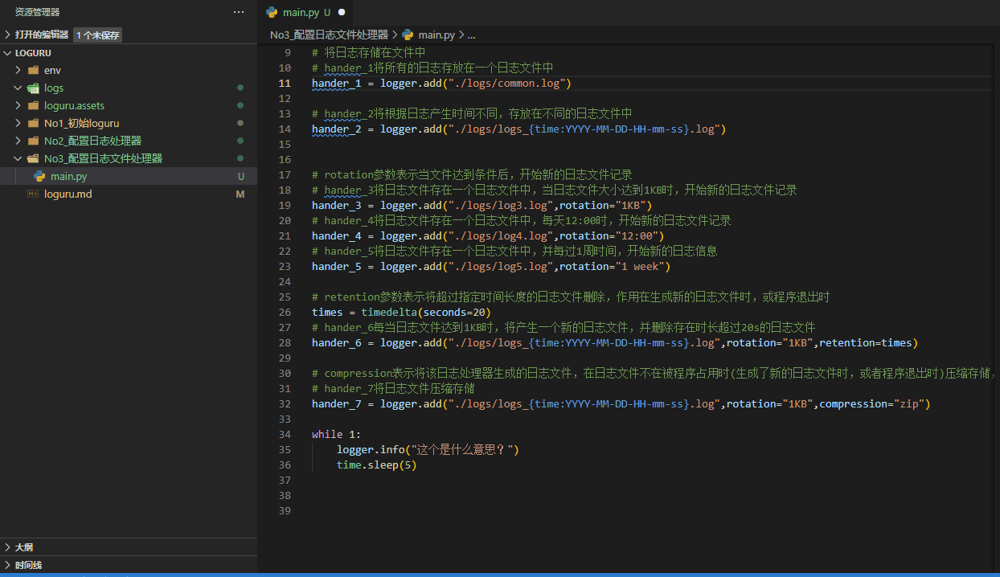

# Loguru简介

Loguru是一个python中用于日志记录的库。

## 特点

- 配置简单，只有一个logger
- 功能强悍，自动记录日志

## 日志的认识

日志就是将程序运行过程中一些关键的信息记录下来，供程序员查看使用。

其中关键的信息通常是：

- 异常报错
- 执行步骤等

通常将日志以文件的形式存储在硬盘中，也可以直接将日志信息输出至窗口。

在loguru中默认将日志信息输出至窗口。



观察这个例子发现，这条日志中主要由三个部分组成：

1. 时间
2. 日志等级
3. 日志具体内容


# 1. 安装  

```shell	
pip install loguru
```

# 2.使用  

## 2.1 初次体验

Loguru的主要内容是logger。

默认情况下logger将日志信息输出到stderr中。

logger是将日志信息传送到配置好的处理器的窗口。

```python	
# 导入logger对象
from loguru import logger

#向控制台输出一个日志信息
logger.debug("this is my first debug log")
```

输出结果：


## 2.2 配置日志处理器

利用logger的add方法，可以配置日志处理器的输出方式，日志内容的格式，过滤规则。

```python
# 展示利用logger的add方法配置一个日志处理器，返回的值代表这个处理器
hander = logger.add(sys.stderr,format="{time} {level} {message}", filter="my_module", level="INFO")

# 展示利用logger的remove方法删除一个日志处理器，当不添加返回值时表示删除系统默认的日志处理器
logger.remove(hander)
```

测试代码

```python
from loguru import logger

# 删除默认日志处理器
logger.remove()

# 自定义一个日志处理器
logger.add(sink="./logs/log.log",format="{time} | {level} | {message}")

# 测试效果
logger.info("这是一个信息日志")

logger.debug("这是一个调试日志")

logger.error("这是一个报错日志")
```

测试结果



## 2.3 配置日志文件

如果想将日志输出到一个文件中，只需要传入一个文件地址字符串即可。

```python
# 展示将日志输出到一个文件中
logger.add("file_{time:YYYY-MM-DD}.log")
```

### 2.3.1 根据时间定义日志文件名称

通过在文件名称中引入loguru内置变量time即可完成。

```python
# hander_2将根据日志产生时间不同，存放在不同的日志文件中
hander_2 = logger.add("./logs/logs_{time:YYYY-MM-DD-HH-mm-ss}.log")
```

### 2.3.2 周期产生日志文件

通过rotation参数完成，周期生成日志文件。如果文件名随变量变化，则会产生新的文件名。否则会覆盖原来的日志文件。

```python
# rotation参数表示当文件达到条件后，开始新的日志文件记录
# hander_3将日志文件存在一个日志文件中，当日志文件大小达到1KB时，开始新的日志文件记录
hander_3 = logger.add("./logs/log3.log",rotation="1KB")
# hander_4将日志文件存在一个日志文件中，每天12:00时，开始新的日志文件记录
hander_4 = logger.add("./logs/log4.log",rotation="12:00")
# hander_5将日志文件存在一个日志文件中，并每过1周时间，开始新的日志信息
hander_5 = logger.add("./logs/log5.log",rotation="1 week")
```

### 2.3.3 周期删除日志文件

通过retention参数完成，删除旧的日志文件。

```python	
# retention参数表示将超过指定时间长度的日志文件删除，作用在生成新的日志文件时，或程序退出时
times = timedelta(seconds=20)
# hander_6每当日志文件达到1KB时，将产生一个新的日志文件，并删除存在时长超过20s的日志文件
hander_6 = logger.add("./logs/logs_{time:YYYY-MM-DD-HH-mm-ss}.log",rotation="1KB",retention=times)
```

### 2.3.4 压缩日志文件

通过compression参数完成，将日志文件存储为压缩文件。

```python
# compression表示将该日志处理器生成的日志文件，在日志文件不在被程序占用时(生成了新的日志文件时，或者程序退出时)压缩存储，
# hander_7将日志文件压缩存储
hander_7 = logger.add("./logs/logs_{time:YYYY-MM-DD-HH-mm-ss}.log",rotation="1KB",compression="zip")

```

### 2.3.5 完整测试代码

```python	
from loguru import logger
import time
from datetime import timedelta

# 删除默认日志处理器
logger.remove()

# 自定义日志文件处理器
# 将日志存储在文件中
# hander_1将所有的日志存放在一个日志文件中
hander_1 = logger.add("./logs/common.log")

# hander_2将根据日志产生时间不同，存放在不同的日志文件中
hander_2 = logger.add("./logs/logs_{time:YYYY-MM-DD-HH-mm-ss}.log")

# rotation参数表示当文件达到条件后，开始新的日志文件记录
# hander_3将日志文件存在一个日志文件中，当日志文件大小达到1KB时，开始新的日志文件记录
hander_3 = logger.add("./logs/log3.log",rotation="1KB")
# hander_4将日志文件存在一个日志文件中，每天12:00时，开始新的日志文件记录
hander_4 = logger.add("./logs/log4.log",rotation="12:00")
# hander_5将日志文件存在一个日志文件中，并每过1周时间，开始新的日志信息
hander_5 = logger.add("./logs/log5.log",rotation="1 week")

# retention参数表示将超过指定时间长度的日志文件删除，作用在生成新的日志文件时，或程序退出时
times = timedelta(seconds=20)
# hander_6每当日志文件达到1KB时，将产生一个新的日志文件，并删除存在时长超过20s的日志文件
hander_6 = logger.add("./logs/logs_{time:YYYY-MM-DD-HH-mm-ss}.log",rotation="1KB",retention=times)

# compression表示将该日志处理器生成的日志文件，在日志文件不在被程序占用时(生成了新的日志文件时，或者程序退出时)压缩存储，
# hander_7将日志文件压缩存储
hander_7 = logger.add("./logs/logs_{time:YYYY-MM-DD-HH-mm-ss}.log",rotation="1KB",compression="zip")

while 1:
    logger.info("这个是什么意思？")
    time.sleep(5)
```

演示结果动画：


