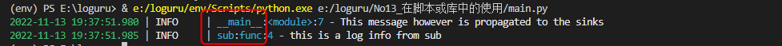

# Loguru简介

Loguru是一个python中用于日志记录的库。

## 特点

- 配置简单，只有一个logger
- 功能强悍，自动记录日志

## 日志的认识

日志就是将程序运行过程中一些关键的信息记录下来，供程序员查看使用。

其中关键的信息通常是：

- 异常报错
- 执行步骤等

通常将日志以文件的形式存储在硬盘中，也可以直接将日志信息输出至窗口。

在loguru中默认将日志信息输出至窗口。


观察这个例子发现，这条日志中主要由三个部分组成：

1. 时间
2. 日志等级
3. 日志具体内容


# 1. 安装  

```shell	
pip install loguru
```

# 2.使用  

## 2.1 初次体验

Loguru的主要内容是logger。

默认情况下logger将日志信息输出到stderr中。

logger是将日志信息传送到配置好的处理器的窗口。

```python	
# 导入logger对象
from loguru import logger

#向控制台输出一个日志信息
logger.debug("this is my first debug log")
```

输出结果：


## 2.2 配置日志处理器

利用logger的add方法，可以配置日志处理器的输出方式，日志内容的格式，过滤规则。

```python
# 展示利用logger的add方法配置一个日志处理器，返回的值代表这个处理器
hander = logger.add(sys.stderr,format="{time} {level} {message}", filter="my_module", level="INFO")

# 展示利用logger的remove方法删除一个日志处理器，当不添加返回值时表示删除系统默认的日志处理器
logger.remove(hander)
```

测试代码

```python
from loguru import logger

# 删除默认日志处理器
logger.remove()

# 自定义一个日志处理器
logger.add(sink="./logs/log.log",format="{time} | {level} | {message}")

# 测试效果
logger.info("这是一个信息日志")

logger.debug("这是一个调试日志")

logger.error("这是一个报错日志")
```

测试结果


## 2.3 配置日志文件

如果想将日志输出到一个文件中，只需要传入一个文件地址字符串即可。

```python
# 展示将日志输出到一个文件中
logger.add("file_{time:YYYY-MM-DD}.log")
```

### 2.3.1 根据时间定义日志文件名称

通过在文件名称中引入loguru内置变量time即可完成。

```python
# hander_2将根据日志产生时间不同，存放在不同的日志文件中
hander_2 = logger.add("./logs/logs_{time:YYYY-MM-DD-HH-mm-ss}.log")
```

### 2.3.2 周期产生日志文件

通过rotation参数完成，周期生成日志文件。如果文件名随变量变化，则会产生新的文件名。否则会覆盖原来的日志文件。

```python
# rotation参数表示当文件达到条件后，开始新的日志文件记录
# hander_3将日志文件存在一个日志文件中，当日志文件大小达到1KB时，开始新的日志文件记录
hander_3 = logger.add("./logs/log3.log",rotation="1KB")
# hander_4将日志文件存在一个日志文件中，每天12:00时，开始新的日志文件记录
hander_4 = logger.add("./logs/log4.log",rotation="12:00")
# hander_5将日志文件存在一个日志文件中，并每过1周时间，开始新的日志信息
hander_5 = logger.add("./logs/log5.log",rotation="1 week")
```

### 2.3.3 周期删除日志文件

通过retention参数完成，删除旧的日志文件。

```python	
# retention参数表示将超过指定时间长度的日志文件删除，作用在生成新的日志文件时，或程序退出时
times = timedelta(seconds=20)
# hander_6每当日志文件达到1KB时，将产生一个新的日志文件，并删除存在时长超过20s的日志文件
hander_6 = logger.add("./logs/logs_{time:YYYY-MM-DD-HH-mm-ss}.log",rotation="1KB",retention=times)
```

### 2.3.4 压缩日志文件

通过compression参数完成，将日志文件存储为压缩文件。

```python
# compression表示将该日志处理器生成的日志文件，在日志文件不在被程序占用时(生成了新的日志文件时，或者程序退出时)压缩存储，
# hander_7将日志文件压缩存储
hander_7 = logger.add("./logs/logs_{time:YYYY-MM-DD-HH-mm-ss}.log",rotation="1KB",compression="zip")

```

### 2.3.5 完整测试代码

```python	
from loguru import logger
import time
from datetime import timedelta

# 删除默认日志处理器
logger.remove()

# 自定义日志文件处理器
# 将日志存储在文件中
# hander_1将所有的日志存放在一个日志文件中
hander_1 = logger.add("./logs/common.log")

# hander_2将根据日志产生时间不同，存放在不同的日志文件中
hander_2 = logger.add("./logs/logs_{time:YYYY-MM-DD-HH-mm-ss}.log")

# rotation参数表示当文件达到条件后，开始新的日志文件记录
# hander_3将日志文件存在一个日志文件中，当日志文件大小达到1KB时，开始新的日志文件记录
hander_3 = logger.add("./logs/log3.log",rotation="1KB")
# hander_4将日志文件存在一个日志文件中，每天12:00时，开始新的日志文件记录
hander_4 = logger.add("./logs/log4.log",rotation="12:00")
# hander_5将日志文件存在一个日志文件中，并每过1周时间，开始新的日志信息
hander_5 = logger.add("./logs/log5.log",rotation="1 week")

# retention参数表示将超过指定时间长度的日志文件删除，作用在生成新的日志文件时，或程序退出时
times = timedelta(seconds=20)
# hander_6每当日志文件达到1KB时，将产生一个新的日志文件，并删除存在时长超过20s的日志文件
hander_6 = logger.add("./logs/logs_{time:YYYY-MM-DD-HH-mm-ss}.log",rotation="1KB",retention=times)

# compression表示将该日志处理器生成的日志文件，在日志文件不在被程序占用时(生成了新的日志文件时，或者程序退出时)压缩存储，
# hander_7将日志文件压缩存储
hander_7 = logger.add("./logs/logs_{time:YYYY-MM-DD-HH-mm-ss}.log",rotation="1KB",compression="zip")

while 1:
    logger.info("这个是什么意思？")
    time.sleep(5)
```

演示结果动画：


## 2.4 格式化输出内容

loguru支持{}方式格式化输出日志内容。

{}中没有变量名称时，根据顺序，将变量放入其中。有变量名称时，将响应的变量内容存放其中。

```python
logger.info("if you're using Python {}, prefer {feature} of course!", 3.6, feature="f-strings")
```


## 2.5 记录异常

在函数前利用**logger.catch**修饰符，可以在函数中出现异常时，将异常记录在日志中。

```pytho
from loguru import logger
@logger.catch
def my_function(x,y,z):
	return 1/(x+y+z)

my_function(0,0,0)
```


## 2.6 日志中支持彩色显示

format参数用来设置，记录日志的内容。并可以通过一些标签，来定义如何显示这些日志内容。

```python
import sys
from loguru import logger
#去除默认日志处理器
logger.remove()
#添加全新日志处理器
logger.add(sys.stderr,format="<yellow>{time}</yellow>--<red>{message}</red>")
#示例一个日志
logger.info("这是一个日志信息")
```


## 2.7 异步，线程安全，进程安全

logger中所有的日志处理器是线程安全的。但不是多进程安全的，但是通过enqueue参数来保证日志的完整性，同样也能保证日志的异步处理。

协同函数作为日志记录池时，应使用complete()等待。

## 2.8 记录完整的日志过程

通过backtrace和diagnose两个参数可以设置在发生异常的时候，记录异常发生的完整过程。

```python
import sys
from loguru import logger

logger.remove()
logger.add(sys.stderr,backtrace=True,diagnose=True)

def func(a,b):
    return a/b

def nested(c):
    try:
        func(5,c)
    except ZeroDivisionError:
        # 输出一个异常日志What？！
        logger.exception("What?!")

nested(0)
```


## 2.9 额外属性的使用

每一条日志都是一个record，每条record中有相应的属性对应日志的内容。


当使用serialize参数时，每个日志信息在被发送到记录池时，会被转变成一个JSON字符串。

```python
logger.add(sys.stderr,serialize=True)
logger.info("这是一个日志信息")
```


当使用bind()方式时，可以更改format参数中extra定义的属性。

```python
# 利用{extra[attr]}定义额外的属性，定义一个额外属性ip
logger.add(sys.stderr,format="{extra[ip]} {message}")

# 利用bind为额外属性ip绑定一个值
logger_1 = logger.bind(ip="localhost")
# 利用绑定了ip属性的日志记录器记录日志
logger_1.info("这是一个日志信息")
# 可以重新绑定ip属性值
logger_1.bind(ip="127.0.0.1").info("这是另一个日志信息")
```


利用contextualize()方法为format参数中的extra定义的属性临时绑定值。

```python
logger.add(sys.stderr,format="{extra[ip]} {message}")
ip = "192.10.10.1"
with logger.contextualize(ip=ip):
    logger.info("这是一个日志信息")
```


这里还可以利用bind进行一些更细粒度的控制。

```python
# filter参数为True时记录日志，此处利用lambda函数查看是否有special额外属性
logger.add(sys.stderr, filter=lambda record: "special" in record["extra"])
logger.debug("This message is not logged to the file")
logger.bind(special=True).info("This message, though, is logged to the file!")
```

patch()函数运行动态的将信息传入日志中。

```python
# 定义一个具有utc额外属性的日志处理器
logger.add(sys.stderr,format="{extra[utc]} {message}")
# 将utc额外属性定义为当前时间
logger = logger.patch(lambda record:record['extra'].update(utc=datetime.utcnow()))
# 测试输出
while 1:
    time.sleep(10)
    logger.info("这是一个日志信息")
```


## 2.10 opt函数的使用说明

对logger对象进行调整，使得生成的日志内容有一些变化。

```python	
from loguru import logger
import sys
import math

# exception参数的说明
# True时记录异常的详细报错信息
# False时忽略详细的报错信息

def fun(x):
    1/x

try:
    fun(0)
except ZeroDivisionError:
    logger.opt(exception=False).error("这是一个错误")

print("----------------------------------")

try:
    fun(0)
except ZeroDivisionError:
    logger.opt(exception=True).error("这是一个错误")


# record 参数的说明
# record 为True时，表示在格式化输出中可以使用record的属性
# record 为False时，表示在格式化输出中不可以使用record的属性
logger.opt(record=True).info("Current line is:{record[line]}")
logger.opt(record=False).info("Current line is:{record[line]}")

# lazy 参数的说明
# lazy 为True时，格式化信息中的变量，将作为一个函数进行调用，并将其结果放入格式化信息中
# lazy 为False时，格式化信息中的变量，将根据其的赋值对象进行存储
logger.opt(lazy=True).debug("if sink <=Debug:{x}",x=lambda:math.factorial(2**5))
logger.opt(lazy=False).debug("if sink <=Debug:{x}",x=lambda:math.factorial(2**5))
logger.opt(lazy=False).debug("if sink <=Debug:{x}",x=1)
# logger.opt(lazy=True).debug("if sink <=Debug:{x}",x=1)

# colors 参数说明
# colors 为True时，日志信息中颜色标签会被渲染
# colors 为False时，日志信息中颜色标签不会被渲染
logger.opt(colors=True).info("<green>这是一个日志信息</green>")
logger.opt(colors=False).info("<green>这是一个日志信息</green>")

# raw 参数说明
# raw 为True时，会忽略sink中添加的信息，而只输出message
# raw 为False时，会添加sink中添加的信息，输出format中的信息
logger.opt(raw=True).info("这是一个日志信息\n")
logger.opt(raw=False).info("这是一个日志信息\n")

# capture 参数说明
# capture 为True时，可以使用extra中的键值对
# capture 为False时，无法使用extra中的键值对
logger.add(sys.stderr,format="{extra[value]}--{message}")
logger_1=logger.bind(value=123)
logger_1.opt(capture=True).info("Displayed but not captured:{valu}",valu="test")
logger_1.opt(capture=False).info("Displayed but not captured:")


# depth 参数说明
# depth 为0时表示当前函数层，1表示外1层函数，n表示外n层函数，main层为module层，n最多为函数的层数
def wrapped():
    logger.opt(depth=0).info("get 0 context")
    logger.opt(depth=1).info("get 1 context")
    logger.opt(depth=2).info("get 2 context")
    logger.opt(depth=3).info("get 3 context")
    # logger.opt(depth=4).info("get 4 context")

def func():
    wrapped()
    # logger.opt(depth=2).info("get func context")

def funcc():
    func()
funcc()
```


## 2.11 自定义日志等级

通过logger的level方法可以自定义一个等级的日志。

并利用logger的log方法来使用自定义的日志等级。

```python
import sys
from loguru import logger

# 自定义一个日志等级
# name表示该日志等级的名称
# no表示该日志等级的安全等级，用来决定合适添加或更新
# color表示该日志等级支持的颜色markdown标签
# icon表示该日志的图标
myLevel = logger.level(name="myInfo",no=25,color="<white><bold>",icon="\!/")
# 使用自定义等级，输出一个日志
logger.remove()
logger.add(sys.stderr,format="{time} {level.name} {level.icon} {message}")
logger.log("myInfo","这是一个利用自定义日志等级，输出的日志")
```


## 2.12 时间处理

```python
import sys
from loguru import logger

# 去除默认日志处理器
logger.remove()

# 创建一个自定义的日志处理器
logger.add(sys.stderr,format="{time:YYYY-MM-DD HH:mm:ss}--{level.name}--{message}")

# 输出一条日志记录
logger.info("这是一条日志信息")
```

## 2.13 在脚本或库中使用

利用logger的enable或disable方法来定义是否记录来自某个库的日志内容。

```python
# sub.py
from loguru import logger

def func(x):
    logger.info("this is a log info from sub")
    return True

# main.py
from loguru import logger
# 利用disable来关闭__main__模块下的日志记录
logger.disable("__main__")
logger.info("No matter added sinks, this message is not displayed")
# 利用enable来开启__main__模块下的日志记录
logger.enable("__main__")
logger.info("This message however is propagated to the sinks")


from sub import func
logger.disable("sub")
func(0)
logger.enable("sub")
func(0)
```



## 2.14 日志错误通知

将邮件通知作为logger的添加池，可以实现在发生一定等级的日志时，通过邮件传递给指定的用户。

```PYTHON
# 主要利用notifiers库
import notifiers
from notifiers.logging import NotificationHandler
from loguru import logger

# 邮箱的信息，寄件人的用户名和密码，收件人邮箱
params={
    "username": "ethanzh-u4406@126.com",
    "password": "PMEK-LQHS-WQMBHI",
    "to": "1574203568@qq.com",
    "host":"smtp.126.com",
    "ssl":True,
    "port":25,
}

# 单独发送一封邮件
notifier = notifiers.get_notifier("email",strict=True)
notifier.notify(message="The application is running",**params)


# 当发生错误日志时，发送警告邮件
handler = NotificationHandler("email",defaults=params)
logger.add(handler,level="ERROR")
```

